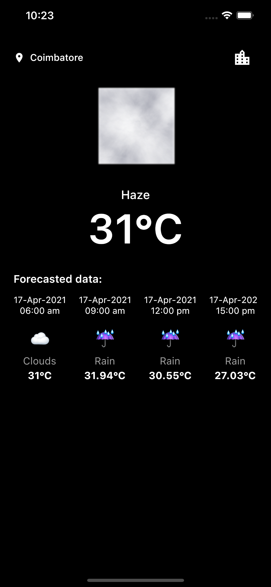
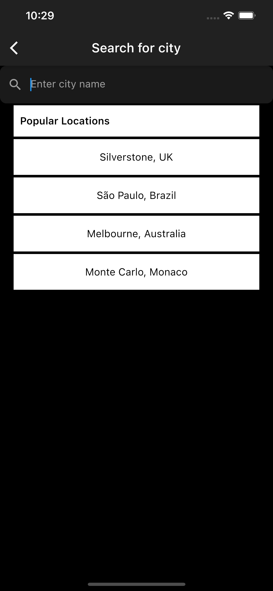
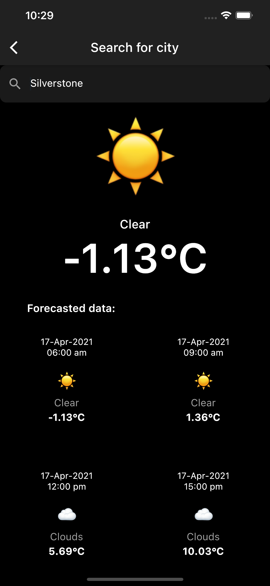

# Weather App

A simple Weather App that uses data from **Open Weather API** - <a>https://openweathermap.org</a>

### Please visit openwathermap and get your free api key and change demoApiKey in lib -> repository -> weather.dart

---

## Screenshots

## Home

- Click Current location(Coimbatore in my case) to refresh data.
- Click City icon to get data by searching city name.
- Scroll horizontally to view more forecasted data.

 

## Search

## Search Suggestion

Search Suggestion is shown for hardcoded popular locations and input

## Search Result

---

## Features supported

✅ &nbsp Fetch <strong>Weather Report for Current Location</strong>

✅ &nbsp Fetch Weather <strong>Forecast Report for next 5 days</strong> for Current Location.

✅ &nbsp Fetch <strong>Weather Report for City Name</strong> entered in Search page.

✅ &nbsp Fetch <strong>Weather Forecast Report for next 5 days for City Name</strong> entered in Search page.

✅ &nbsp <strong>Offline storage</strong> for all the above features. <i> All you need is fetch data atleast once, before you go offline.</i>

✅ &nbsp If switched from <strong>Offline to Online, data is synced automatically</strong>

 
<b>What about tests?</b>

✅ &nbsp Since business logics are written in Flutter Bloc, Added Bloc test. Bloc test for online mode works

[x] &nbsp Bloc test for offline mode will be added soon

